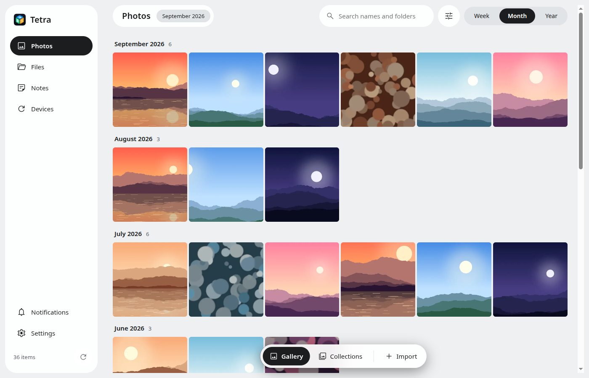
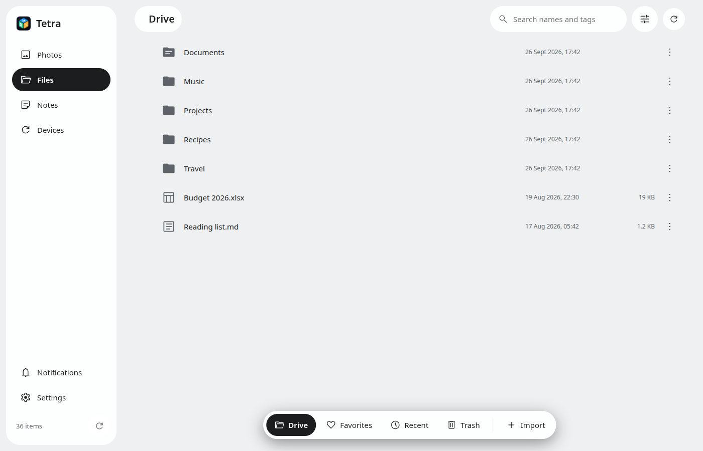
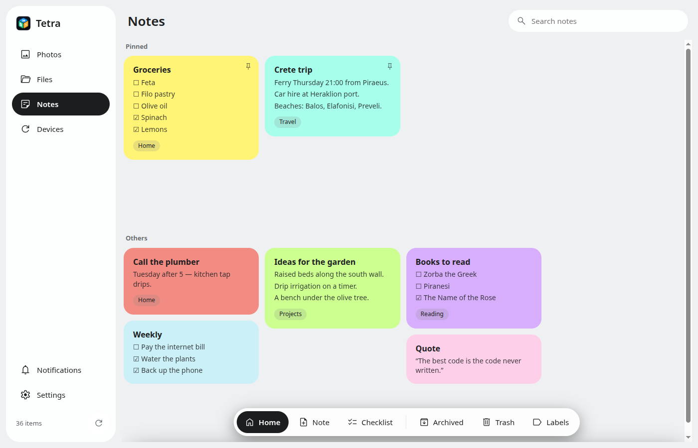

# Tetra for the desktop


**Your photos, files and notes, kept on your own devices.** Tetra for the desktop is the computer side of
[Tetra for Android](https://github.com/kalotrapezis/Drive-Android): a photo library, a file manager and notes, which
your phone and tablet sync with over your own Wi-Fi. Nothing is uploaded anywhere. Faces, documents and search labels
are analysed on this computer.

**Current release: 0.3.0 Beta 1** (Linux, `.deb` and AppImage). It is the first beta: in daily use by its author, but
keep your own backups.

| Photos | Files | Notes |
|---|---|---|
|  |  |  |

<sub>Screenshots use demo content, not a real library.</sub>

## What it does

| | |
|---|---|
| **Photos** | Week, month and year timeline, collections, favorites, folder albums, People, Documents, a map, search, an editor and an encrypted **Hidden** vault. |
| **Files** | `~/Tetra/Files`, with tags, favorites, folder colours, a reversible Trash, and import in verified batches. |
| **Notes** | Notes and checklists with colours, labels, pins and a history of three versions. They sync with the phones. |
| **Devices** | Pair a phone or tablet by QR code. Every photo and file is checked by SHA-256 on arrival. Rules per device and per kind of content: send, both ways, or Move. |
| **Storage drives** | A USB drive as a **backup** (a verified copy) or as **storage**: old photos move there and still show in the library. Tetra tells you before the disk fills up ("Free 21 GB?"). |
| **Trash → purgatory → gone** | Deleted items wait 30 days in the Trash, then 30 more in a purgatory, before they are really gone. |

## Install

Download the `.deb` or the AppImage from [Releases](https://github.com/kalotrapezis/Drive/releases).

```bash
sudo apt install ./local-drive-desktop_0.3.0-beta.1_amd64.deb
```

The AppImage needs `libfuse2` on Ubuntu 24.04 and newer. Tetra keeps running in the tray when its window is closed.

## Build

The app is in [desktop/](desktop/README.md) (Electron, React, TypeScript).

```bash
cd desktop
npm ci
npm test
npm run dist    # release/*.deb and *.AppImage
```

## Documentation

| Document | Purpose |
|---|---|
| [desktop/README.md](desktop/README.md) | The desktop app's code map, folders and development commands |
| [SYNC_PLAN.md](SYNC_PLAN.md) | Sync design and every rule's reason (the same file in both repos) |
| [HANDOFF.md](HANDOFF.md) | Where work stands, newest first |

---

## History: the C++/Qt "Local Drive"

Until September 2026 this repository held a C++/Qt desktop app with a browser-page interface. It was replaced by
the Electron app in `desktop/` and removed on 26 September 2026. Its code, plans and safety specification are in the
history, at commit [`1b71025`](https://github.com/kalotrapezis/Drive/tree/1b710253ee846a965f3524138332fda6ae37897a).
