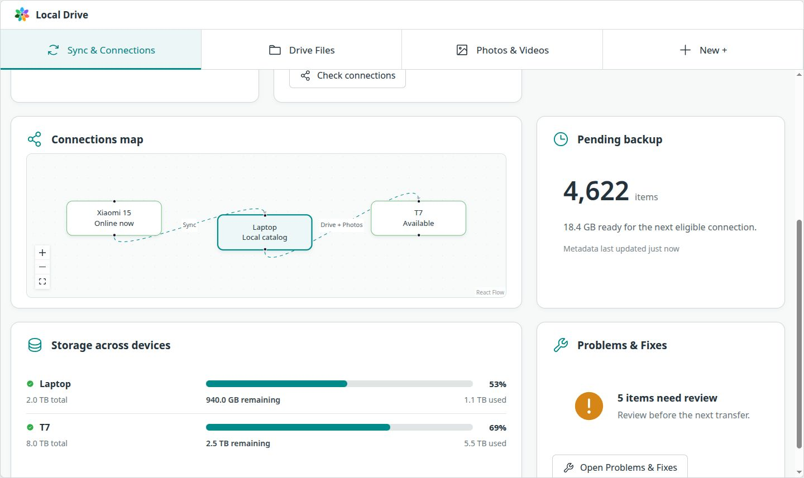
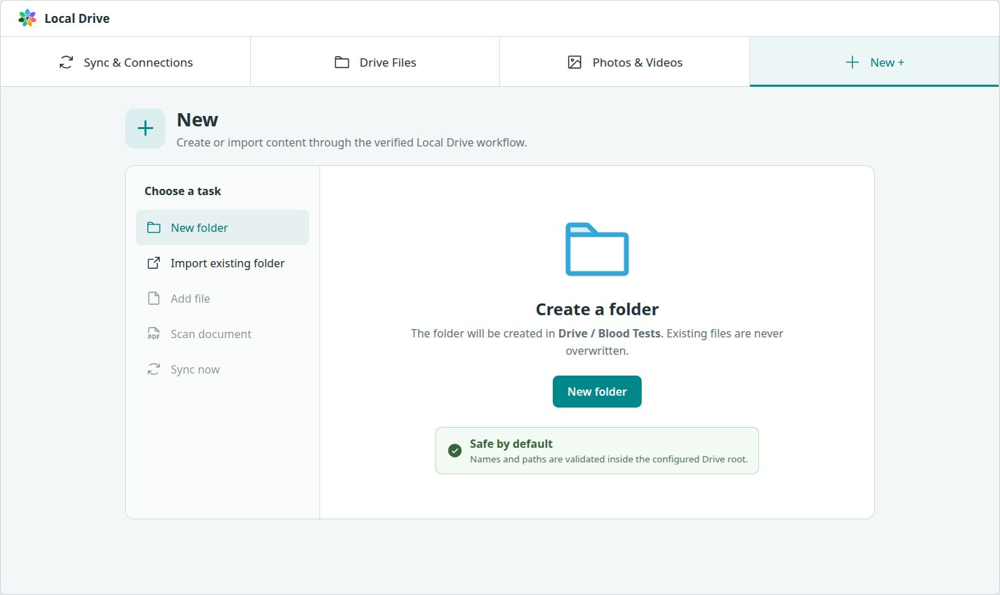
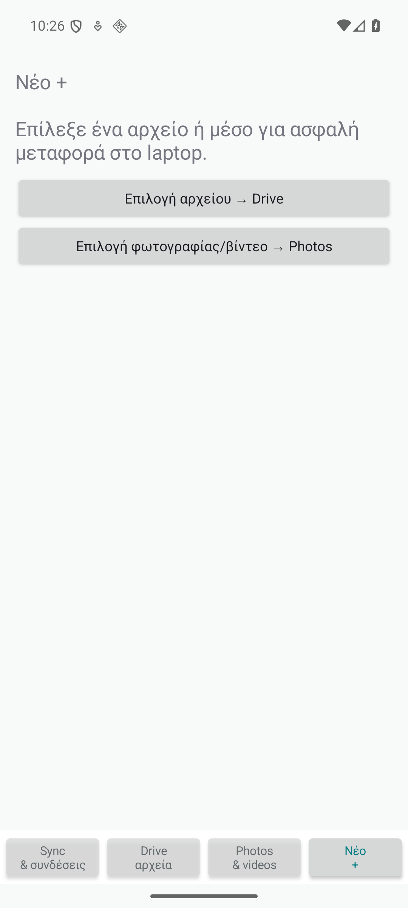
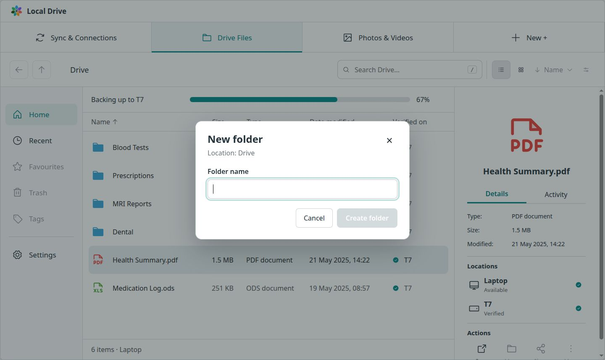
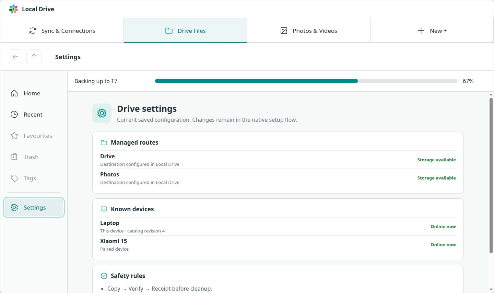
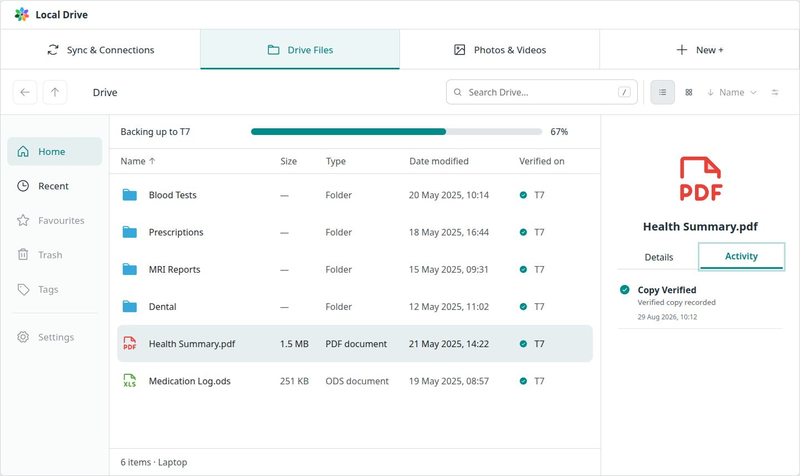

# Local Drive Sync & Connections design QA

> Dated visual evidence. Current release gates and next steps are in [Plan-V2.md](Plan-V2.md). Old screenshots do not certify the final package.

## 2026-09-04 — Drive Tags filter bar

Scope: the annotated tag bar only; preserve the existing production shell, fifth Settings tab and real backend. No new raster assets required; colored circles use the existing Phosphor icon library.

- Source: `/tmp/codex-clipboard-7fcd4299-67a0-4c38-b56e-9dfbba628639.png` (704×492, app embedded in a padded, scaled canvas).
- Implementation: `/tmp/drive-tags-qa.png`, browser-rendered at 1117×811, `http://127.0.0.1:43173/`, separate QA catalog.
- State: Drive → Tags, list view, empty selected category. Source shows an empty list with no explicit active category; implementation selects empty Masters Deg. Both images were opened together for full-view and focused tag-bar comparison. Compare app-owned bar placement/proportions, not raw pixels across the source's scaled canvas or older app chrome.
- Typography: existing Inter/Noto Sans UI retained instead of reproducing handwritten annotations; names readable, selected label clear.
- Spacing/layout: horizontal rounded group below column headings, above results; wrapping enabled. First check found an undefined border token; replaced with the existing shell border color and recaptured. Final group border visible, controls not clipped at checked desktop width.
- Colors: pastel circle icons, neutral All icon, teal selected state consistent with the app. Color is decorative; readable names and aria-pressed convey selection.
- Assets: existing logo and icon library retained, no placeholders or generated illustrations.
- Copy/content: actual registered tags, alphabetical order, All, specific empty-tag message. Example names/colors are not hard-coded into production data.
- Interactions: All showed three tagged files and excluded the untagged file; Work showed two; Personal showed two; search narrowed to Shared; descending sorting reversed the two Personal results; grid/list and empty Masters Deg checked. Final All state restored. Console errors: none.
- Automated: TypeScript, nine web tests, production build passed.
- Findings: no outstanding P0/P1/P2 issues within the requested filter-bar scope. Whole-app mobile layout and physical transfers are not covered by this check.
- Checklist: implementation, browser filtering checks, focused comparison and border fix complete. No deployment or installed Alpha update.
- final result: passed

## Connections map

- React Flow renders device → local catalog → storage from the same fixture/API
  state as Connected devices and Storage across devices.
- Edges show Sync and the routed Drive + Photos content; online/present edges
  animate while last-reported nodes remain visible.
- The final two-column card keeps nodes at readable scale and both 1440×857 and
  1024×768 checks report zero horizontal overflow.

## Desktop New workspace

- New + is a selected top-level tab, not a popup menu.
- New folder inherits the last browsed Drive location; Import existing folder
  opens the existing verified import dialog from the same workspace.
- Both 1440×857 and 1024×768 checks report zero page/workspace overflow.
- Add file, Scan document, and Sync now remain visibly disabled until their
  actual workflows exist.

## Android bottom navigation

- The same four primary sections are fixed at the bottom on Android: Sync &
  Connections, Drive Files, Photos & Videos, and New +.
- A live `notes_phone` emulator install selected Drive, Photos, and New in
  sequence; the UI tree reported the matching page and selected navigation item.
- Insets reserve the status and gesture-navigation areas, and the status icons
  remain readable on the light shell. Physical-phone QA is still pending.

## New folder

- New + opens a focused folder-name dialog for the current Drive location.
- The dialog stays inside both 1440×857 and 1024×768 viewports with zero
  horizontal overflow at the supported compact desktop width.
- API coverage rejects missing authorization, traversal, invalid names, and
  collisions; successful creation never overwrites an existing item.

## Drive Settings

- The existing Settings navigation now opens saved routes, known devices,
  catalog revision, storage availability, and the locked safety rules.
- Desktop 1440×857 and compact 1024×768 checks both report zero horizontal
  overflow; the file inspector is removed from this non-file view.

## Per-file Activity

- Drive and Photos expose the same bounded append-only transfer history.
- The 1440×857 desktop viewport has zero page or inspector overflow.
- The API test proves a verified import appears for the exact Photos file and
  rejects traversal outside the configured root.

- Source visual truth: `design/mockups/sync-connections-top-tabs-v1.png`
- Final implementation: `design/qa-sync-connections-web.jpg`
- Combined comparison: `design/qa-sync-connections-comparison.jpg`
- Source size: 1536 × 1024 px
- Browser QA viewport: 1280 × 720 CSS px, device pixel ratio 1
- State: development fixture with an active transfer, three connected devices,
  pending catalog work, storage reports, and no problems

## Findings

No actionable P0, P1, or P2 differences remain.

- P3: The browser preview omits native desktop window controls. Electron will
  own that chrome after browser approval.
- P3: Pending work currently exposes the real aggregate count and bytes. A
  Files/Photos/Videos breakdown should appear only after the catalog provides
  those truthful per-content counts.
- P3: At 1280 × 720 the lower cards continue below the viewport and the Sync
  content scrolls internally; the fixed app shell and top tabs remain visible.

Typography, spacing, semantic colors, icons, card hierarchy, and visible copy
were checked against a top-aligned, scaled viewport comparison. The four top
sections, health banner, transfer/device/pending cards, storage summary, and
Problems & Fixes placement match the selected direction.

## Interaction and runtime checks

- Sync & Connections, Drive Files, and Photos & Videos all switched views.
- New + opened its action menu with New folder, Import existing folder, and
  Scan document.
- The non-fixture browser run loaded live data from the loopback C++ API.
- Browser console: no application warnings or errors.

## Comparison history

1. First pass: the app shell's minimum height created page-level horizontal and
   vertical overflow in the 1280 × 720 preview (P1).
2. Fix: the shell now follows the viewport and only the Sync content scrolls.
3. Second pass: desktop card sizing was too tall at the smaller preview width
   (P2).
4. Fix: a native CSS breakpoint reduces top chrome, banner, and card density
   below 1300 px without altering the 1536 × 1024 target layout.
5. Final pass: no actionable P0/P1/P2 findings remained.

## Photos & Videos timeline slice

- Source visual truth: `design/mockups/gallery-timeline.png`
- Final implementation: `design/qa-photos-timeline-web.jpg`
- Combined comparison: `design/qa-photos-timeline-comparison.jpg`
- Browser QA viewport: 1280 × 720 CSS px, device pixel ratio 1

The selected gallery hierarchy is retained inside the new top-tab shell:
toolbar, photo navigation, month timeline, dense media grid, selection, and
details panel. Collections are derived from folders and open as real filtered
timelines. Photos, Videos, Recent, filename search, and the live empty state were
also exercised.

- P3: Fixture thumbnails are CSS crops from the approved mockup and may expose a
  thin adjacent-image edge; real media uses one isolated thumbnail per item.
- P3: Video thumbnails use a Play placeholder until a native thumbnail provider
  is selected.
- Browser console: no application warnings or errors.

## Import existing folder preview

- Final implementation: `design/qa-import-preview-web.jpg`
- Browser QA viewport: 1280 × 720 CSS px, device pixel ratio 1

`New +` opens a keyboard-accessible menu and Import existing folder opens a
modal with source, Drive/Photos target, explicit preview-first safety copy, scan
state, and a four-part result summary. A real four-file DCIM sandbox scan
reported 441 KB to copy, no false identical files, and no review findings. The
browser console remained clean.

- P3: The browser stage accepts a typed local path. The packaged desktop shell
  must replace it with a native folder chooser before desktop packaging. Clean
  previews can now execute through Copy → Verify → Receipt; findings remain
  blocked for Problems & Fixes.
- P3: New folder and Scan document remain visibly disabled rather than acting
  as fake commands.

**final result: passed**

## First-seen storage relationship wizard

- Browser fixture: `?fixture&newstorage`.
- Verified that mounted SAF shows its stable identity, mount location, and
  filesystem before offering Not now, persistent Hide, or Add to map.
- Add to map opens the Files map with SAF visible and proposes the editable
  roots `/home/teo/Local Drive/Drive` and
  `/run/media/teo/SAF/Local Drive/Drive`.
- The modal initially gave React Flow a zero-height internal viewport. Giving
  the editor an explicit 240 px height fixed the rendering; visual QA then
  showed Xiaomi, Laptop, T7, and SAF together.
- The flow reaches Add another relationship and the one-time Photos-map copy.
  Native tests cover persistent hide/show and transactional map cloning.

**final result: passed**

## USB phone export and mount attention

Browser QA exercised the desktop layout at 1440 × 900 and the normal responsive
viewport. A connected-but-unmounted storage now produces a top-level attention
banner with a reachable **Mount storage** action while retaining its UUID-backed
device row. The Drive inspector enables **Send to phone** only for a present MTP
phone with a stable identity; the charging-only fixture keeps it disabled and
shows the exact Android File transfer guidance. The visual pass found and fixed
an inconsistent fallback between live and remembered device lists.

The real Xiaomi 15 check created a missing nested Drive path, copied a 1 MiB
fixture from the mounted SAF disk, matched SHA-256 after MTP read-back, and
repeated without a duplicate. The UI polls append-only activity by event ID and
reports verified, conflict, failure, or continuing state.

The phone card now also exposes **Import Drive** and **Import photos & videos**.
Browser QA confirmed both are enabled for File transfer/MTP, hidden for the
charging-only state, and produce visible completion feedback without crowding
the existing four-step guide.

**final result: passed**

## Phone recheck evidence

- Final implementation: `design/qa-problems-recheck-web.png`
- Browser QA viewport: 1440 × 857 CSS px

The External changes fixture exposes the receipt-backed phone path, source root,
expected size, complete SHA-256 evidence, safety invariant, and **Recheck on
phone** action. The details panel correctly identifies Phone metadata rather
than the managed-folder watcher. Runtime measurements found no horizontal
overflow; the action row ends at 822 px inside the 857 px viewport, so all
information and both actions remain visible without panel scrolling.

**final result: passed**

## Drive folder navigation

- Final implementation: `design/qa-files-folder-navigation.png`
- Browser QA viewport: 1440 × 857 CSS px

Double-clicking a folder updates the Drive-relative breadcrumb and search scope;
Back and Up become available, and an empty nested fixture reports an honest
empty state instead of retaining root files. No horizontal overflow was found.
The API regression separately proves a real nested file response and rejects
`../` traversal outside the configured Drive root.

**final result: passed**

## Drive Open action

- Final implementation: `design/qa-files-open-action.png`
- Browser QA viewport: 1440 × 857 CSS px

For a selected regular file, Open is the only enabled details action and states
that it uses the default desktop app. Move, Share, and More remain explicitly
disabled. The API regression proves valid nested-file acceptance and rejection
of both traversal and a symlink targeting a file outside the Drive root.

**final result: passed**

## Recent Files

- Final implementation: `design/qa-files-recent.png`
- Browser QA viewport: 1440 × 857 CSS px

Recent shows only files, a dedicated breadcrumb/search scope, a correct item
count, and the normal details/Open inspector with no overflow. Favourites,
Trash, Tags, and Settings are visibly disabled instead of opening placeholder
content. The API regression proves newest-first ordering and Drive/Photos route
isolation.

**final result: passed**

## Photos & Videos Open action

- Final implementation: `design/qa-photos-open-action.png`
- Browser QA viewport: 1440 × 857 CSS px

The selected media inspector shows preview, complete metadata, locations, Open,
and its status without internal scrolling or horizontal overflow. The same
token-authorized endpoint accepts a real Photos-root item and rejects an unknown
root; Drive traversal and external-symlink checks remain shared. The dev fixture
asset is explicitly allowed from the project root and loaded successfully, so
the visual gate exercises real thumbnails rather than grey placeholders.

**final result: passed**

## Web route Setup

- Browser QA viewports: 1440 × 857 and 1024 × 768 CSS px

The missing Photos route form remains fully visible with no page or Settings
horizontal overflow. Saving the fixture adds Photos to Managed routes and
replaces the form with the completed state. The native API regression separately
proves invalid-path rejection, persistence, and duplicate-route rejection.

**final result: passed**

## Managed route Preview

- Browser QA: normal desktop viewport

Drive and Photos route cards show their exact destination and Keep policy.
Preview uses a distinct action, adds the result inline without layout shift or
horizontal overflow, and reports total files/bytes, transfer bytes, identical
items, and conflicts. The API regression proves token enforcement, unknown-route
rejection, and a real one-file preview through the verified engine.

The exact successful preview reveals Transfer verified files. Completion stays
inline, replay is disabled, and browser QA found no page or Settings overflow.
The backend regression executes a Move-policy route, verifies the destination
bytes, proves the source still exists, and requires Cleanup pending rather than
deleting it.

Manifest export reports a completed download from that exact Preview ID. Recent
activity expands inline and shows the verified event/result/date. Browser QA
found no page or Settings overflow; the API regression verifies the exported
path and size plus the append-only `verified / verified copy` history record.

Pause swaps to Resume while Cancel remains available. Browser QA completed the
Pause → Resume → Cancel sequence without overflow and showed that the source
was retained with no incomplete publication. A deterministic backend hook proves
the catalog reaches Paused, resumes, then cancels before publish; Transfer is
hidden after failure until the user runs a fresh Preview.

**final result: passed**

## Responsive storage details card

- Source visual truth: `/tmp/codex-clipboard-3c199fee-9117-43c4-89cc-f49e7393a921.png`
- Browser implementation: `design/qa-storage-card-responsive.png`
- Combined comparison: `design/qa-storage-card-comparison.png`
- Viewport: 1118 × 811 CSS px, device scale 1
- Source pixels: 1372 × 402; implementation pixels: 1118 × 811
- State: Sync & Connections fixture, storage card visible in the two-column
  breakpoint where the previous four-column row overflowed.

The focused side-by-side comparison confirms the mockup's intended hierarchy:
each device has a first line for status/name, progress, and percentage, followed
by total, remaining, and used capacity. The implementation intentionally keeps
the product's existing Inter-like UI typography, teal token, native progress
control, border radius, and dynamic fixture values instead of copying the
handwritten annotation style or its example numbers. No raster assets were
required; the existing Phosphor database and status icons remain sharp and
consistent. Copy is complete and none of the six capacity values truncate or
leave the card horizontally.

Focused-region comparison was required because the full dashboard makes the
small capacity labels difficult to judge. The crop in
`design/qa-storage-card-comparison.png` shows all labels clearly. Semantic DOM
inspection also confirmed both progress controls have device-specific accessible
names and all total/remaining/used values are present. Primary dashboard tabs
and Problems & Fixes remain unchanged. TypeScript, Vite production build, and
all four Sites worker tests pass.

Comparison history:

- P1 before fix: the single-row grid required approximately 575 px plus card
  padding, so its percentage/value columns clipped at the 1180 px breakpoint.
- Fix: replaced it with a compact two-line grid, reduced minimum tracks at the
  narrow desktop breakpoint, and kept total/remaining/used as independent
  readable values.
- Post-fix evidence: `design/qa-storage-card-responsive.png` and the combined
  comparison show both Laptop and T7 rows fully contained with no P0/P1/P2
  mismatch. No further visual fix was required.

P3 follow-up: a true single-column/mobile dashboard breakpoint can stack the
remaining/used pair vertically when the Android surface adopts this component.

**final result: passed**

## Problems decision history

- Final implementation: `design/qa-problem-decision-history.jpg`
- Browser QA viewport: 1280 × 720 CSS px

The fixture exercised Save for review on a duplicate, dismissal of a clean
external observation, active-count removal, and the resulting decision-history
list. Unsafe duplicate dismissal is rejected by the API test. The browser
console remained clean.

The duplicate details panel now remains below the list at narrower desktop
widths instead of disappearing. Browser QA exercised **Use existing copies**,
removed the resolved group from the active list, incremented Decision history,
and reported no console errors.

Browser QA also exercised **Keep both safely** for an imported conflict. The
conflict left the active list, the total changed from 4 to 3, and Decision
history showed `Conflicts · Kept both versions` without a layout regression.

Browser QA now covers **Keep unsupported in source** as well. The Unsupported
filter exposed the exact symlink path and the action remained reachable in the
stacked details layout. Applying it reduced active findings from 5 to 4 and
added `Unsupported · Kept unsupported in source` to Decision history with no
visual regression.

**final result: passed**

## Managed-folder external changes

- Final implementation: `design/qa-external-changes-watcher.jpg`
- Browser QA viewport: 1280 × 720 CSS px

The Problems & Fixes fixture now covers the watcher-backed External changes
category, Saved for review state, managed root, and reported relative paths.
Category filtering and details were exercised with no browser console errors.
The runtime was also started against an isolated catalog; its loopback health
endpoint and schema-v9 startup succeeded without touching configured user roots.

**final result: passed**

## Problems & Fixes review center

- Final implementation: `design/qa-problems-fixes-web.jpg`
- Browser QA viewport: 1280 × 720 CSS px

The Sync health card opens a persistent review center backed by the local
catalog. Fixture checks covered category totals, Duplicates and Conflicts
filtering, selected-item details, reported paths, and return to Sync. Import
preview findings are saved idempotently; this screen remains read-only and
does not expose unimplemented file actions. Browser console: no warnings or
errors.

- P3: Replace-existing remains gated on a future Trash-backed correction path;
  the implemented conflict action only keeps both versions safely.
- At widths below 1180 px the details inspector stacks below the item list so
  resolution actions remain reachable. Android still needs its native compact
  Problems surface.

**final result: passed**
## Connection cards — 2026-09-03

- Source: `/tmp/codex-clipboard-3ce43545-9e03-489a-8a56-25229c679bb9.png`
- Prototype: `/tmp/local-drive-connection-cards-final.png`
- Comparison: `/tmp/connection-card-comparison.png`
- Primary controls fit in one centered stack between two device cards.
- Drive/Photos switch, second-device picker, Advanced paths, and read-only full map are interactive.
- Browser console: no warnings or errors.
- P0/P1/P2: none.
- P3: drag-and-drop is intentionally deferred; the click picker provides the same working device selection without hidden drop targets.

final result: passed

## 2026-09-04 — Connection cards and verified Move

- Browser QA at localhost:5173: Settings → Drive card → Copy to Move → Preview → Transfer → Review source cleanup → confirmation → Move complete. Simulated UI data used for interaction QA; native API tests use isolated temporary files and actual KIO Trash.
- Cards expose retention and preview/transfer/history directly. Add-card no longer stretches to the full height of an expanded transfer review.
- Native checks cover unauthorized/premature/replayed cleanup, stale settings, recovered cleanup, source changes, successful Trash and recorded history. Reviewed retention cutoff is fixed for execution.
- Existing device hiding, connection removal, copy and pause/resume/cancel tests pass. Physical-device interruption and hub/two-way workflows remain outside this change.

## 2026-09-04 — Year retention and card helper text

Added Keep last year in card, setup, legacy UI, validation and receipt/cleanup policies. Calendar-year cutoff and migration from populated schema 17 are tested; schema 18 keeps foreign-key links and history intact. Verified small plain Copy helper text under the native selectors in the live browser. Native model, transfer and API tests and web build pass.

## 2026-09-04 — Sync scheduling and pending transfers

- Live Settings exposes connection/source, once/daily/weekly/monthly recurrence, native date/time and Europe/Athens timezone. No real transfer schedules were created during QA.
- Browser screenshot inspection of the demo confirmed readable two-column fields, populated edit date, monthly selection and pending notification with a concise disk label. Demo mutation controls remain disabled.
- Native API suite: 19 passed. Final scheduling checks: 4 passed, including monthly clamping, DST, persisted missed schedules, missing disk, phone-to-laptop intake and explicit Start forwarding after the phone disconnects. Phone transport was simulated using isolated temporary files; physical USB interruption was not tested.
- TypeScript/build and four Sites packaging tests passed. Updated development backend is running at loopback; no scheduler wake service or installed-package update was performed. Move cleanup remains a separate reviewed action.

## 2026-09-04 — Connection Cache and percentage limit

- Cache on/off is active inside each connection card. Advanced contains only a percentage input (80% default); the obsolete global disabled hub row is absent when unused.
- Browser demo QA: enable Cache, open Advanced, change 80 to 75, save and verify Preview remains available. Live Settings shows the default 80% without changing user settings. Screenshot inspection confirmed readable spacing and no GB limit input.
- Native tests: 19 API checks passed, including disabled intake, percentage-full rejection with originals retained, notice deduplication and explicit forwarding while Cache stays enabled. Model suite passed 25 checks; final focused checks also covered limit persistence, cloning and catalog upgrades. Seven targeted transfer checks passed. Two web availability checks and four packaging checks passed; TypeScript/build passed.
- Capacity notifications monitor local source disks every 30 seconds; intake reserves the configured free percentage before each file. Tests used temporary files and simulated phone transport, not a physical full-disk/USB test. Development backend restarted; no real cache settings or transfers were changed during QA.
